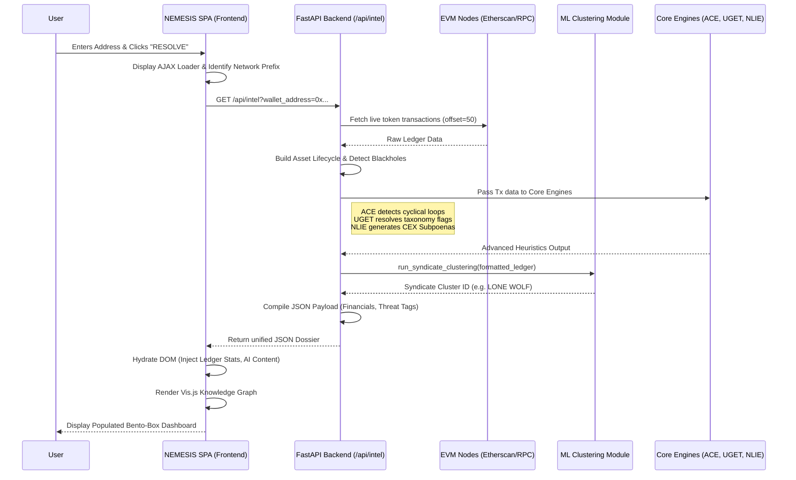
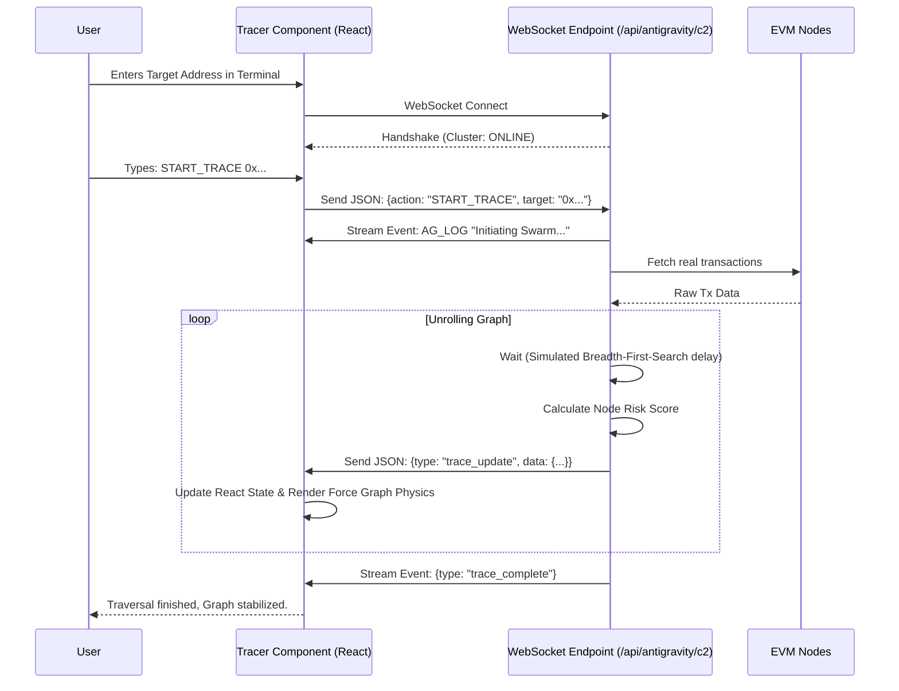
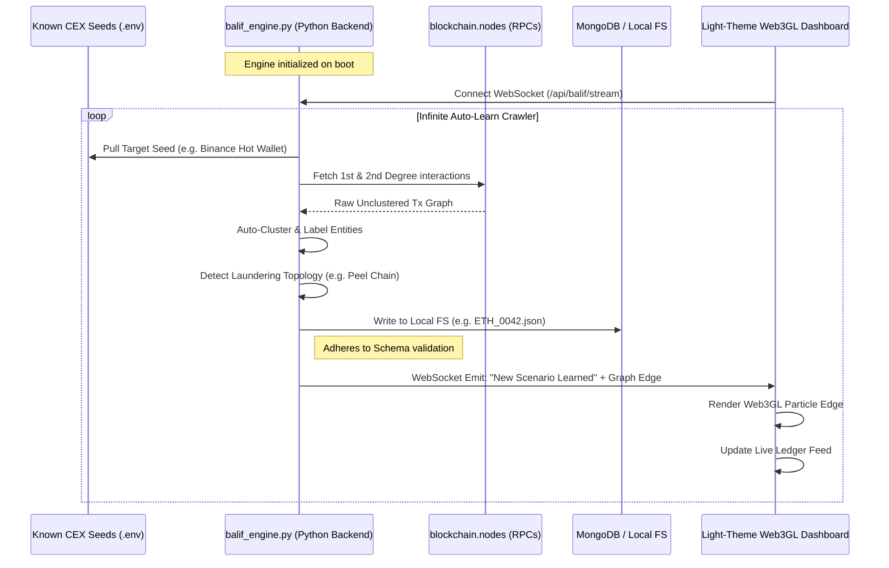

# NEMESIS Platform Execution Flows

This document outlines the complete start-to-end execution flows for the three core pillars of the NEMESIS platform: **NEMESIS ID**, the **NEMESIS Tracer**, and the **BALIF Scenario Auto-Learning Engine**.

---

## 1. NEMESIS ID: Start-to-End Execution Flow

The NEMESIS ID is a synchronous, API-driven intelligence resolver that aggregates on-chain telemetry, OSINT, and machine learning heuristics into a single dossier.

---

## 2. NEMESIS Tracer: Start-to-End Execution Flow

The NEMESIS Tracer is an asynchronous, WebSocket-driven application designed to stream real-time node discoveries to a physical, force-directed graph.

---

## 3. BALIF Scenario Auto-Learning Engine: Execution Flow

This engine autonomously crawls the blockchain, seeded by known CEX wallets, to generate a massive local dataset (`BALIF-NEMESIS-Scenario-Library`) of laundering topologies. It streams live updates to a dedicated Light-Theme Web3GL Dashboard.

### Detailed Breakdown:
1. **Engine Initialization**: The `balif_engine.py` runs as a persistent background daemon. It loads the database credentials, proxy endpoints, and known CEX seed wallets from the `.env` file.
2. **Auto-Clustering Crawler**: The engine iterates through the seed wallets. It hits the configured RPCs (`blockchain.nodes`) to pull the raw transaction graph. 
3. **Topology Detection**: It analyzes the 1st and 2nd-degree connections. If it detects a specific pattern (e.g., `Flash Loan -> Arbitrage -> Tornado Cash`), it tags this as a new scenario.
4. **Dataset Generation**: It formats the data into the strict `BALIF-NEMESIS` JSON schema (containing entities, graph edges, expected normalized events, and MITRE ATT&CK mapping). It saves this payload directly into the `BALIF-NEMESIS-Scenario-Library` directory structure.
5. **Real-Time Web3GL Streaming**: Simultaneously, the engine pushes a WebSocket event to the Light-Theme SPA Dashboard. The frontend intercepts this JSON payload and dynamically updates the Live Ledger Table and the Web3GL Knowledge Graph visualizer.
